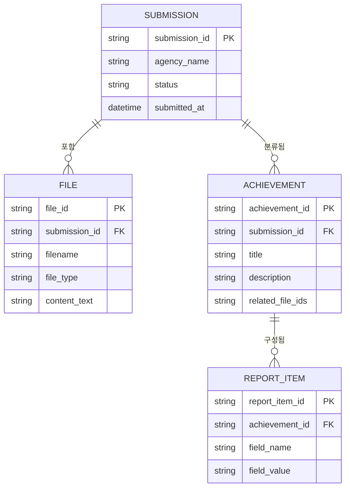

# ERD — 데이터기반행정 활성화 제고 노력_정성보고서

> 최종 수정: 2026-03-19

## 개요

이 서비스는 n8n 워크플로우 기반으로 영구적인 데이터베이스가 없습니다.
파일은 워크플로우 실행 중에만 임시로 보유되며, 완료 후 별도 저장하지 않습니다.
ERD는 워크플로우 내부에서 처리되는 **논리적 데이터 모델**을 정의합니다.

엔티티 목록:
- **SUBMISSION**: 기관 제출 건 (1회 실행 단위)
- **FILE**: 제출된 증빙 파일
- **ACHIEVEMENT**: AI가 분류한 실적 단위
- **REPORT_ITEM**: 첨부7 양식의 항목별 초안 내용

---

## 엔티티 다이어그램

---

## 테이블 상세

### SUBMISSION

| 컬럼명 | 타입 | 제약 | 설명 |
|---|---|---|---|
| submission_id | STRING | PK | 제출 건 고유 식별자 (UUID) |
| agency_name | STRING | NOT NULL | 기관명 |
| status | STRING | NOT NULL | 처리 상태 (processing / completed / failed) |
| submitted_at | DATETIME | NOT NULL | 제출 일시 |

### FILE

| 컬럼명 | 타입 | 제약 | 설명 |
|---|---|---|---|
| file_id | STRING | PK | 파일 고유 식별자 |
| submission_id | STRING | FK → SUBMISSION | 소속 제출 건 |
| filename | STRING | NOT NULL | 원본 파일명 |
| file_type | STRING | NOT NULL | 파일 형식 (pdf / docx / jpg / png) |
| content_text | STRING | | Claude API가 추출한 텍스트 내용 |

### ACHIEVEMENT

| 컬럼명 | 타입 | 제약 | 설명 |
|---|---|---|---|
| achievement_id | STRING | PK | 실적 고유 식별자 |
| submission_id | STRING | FK → SUBMISSION | 소속 제출 건 |
| title | STRING | NOT NULL | AI가 추출한 실적명 |
| description | STRING | | 실적 요약 설명 |
| related_file_ids | STRING | | 연관 파일 ID 목록 (JSON 배열 형식) |

### REPORT_ITEM

| 컬럼명 | 타입 | 제약 | 설명 |
|---|---|---|---|
| report_item_id | STRING | PK | 항목 고유 식별자 |
| achievement_id | STRING | FK → ACHIEVEMENT | 소속 실적 |
| field_name | STRING | NOT NULL | 첨부7 양식 항목명 (목적_및_필요성 / 추진_내용 / 기대_효과 등) |
| field_value | STRING | | AI가 작성한 항목 내용 초안 |

---

## 관계 요약

| 관계 | 설명 |
|---|---|
| SUBMISSION \|\|--o{ FILE | 한 제출 건에 복수 파일 첨부 |
| SUBMISSION \|\|--o{ ACHIEVEMENT | 한 제출 건에서 복수 실적 분류 |
| ACHIEVEMENT \|\|--o{ REPORT_ITEM | 한 실적에 첨부7 양식 복수 항목 구성 |
